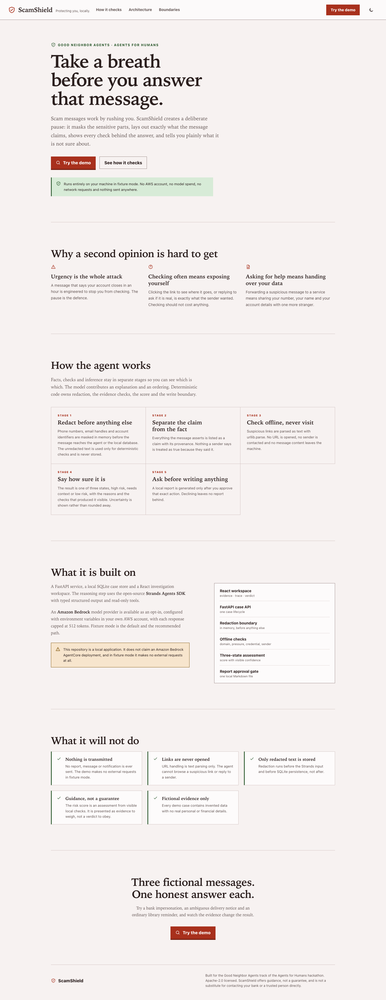
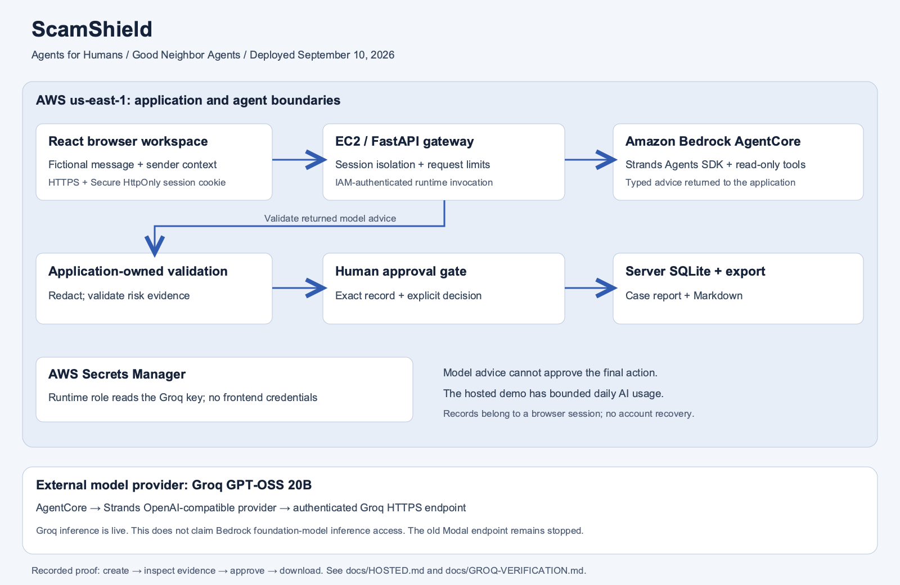

# ScamShield

[Open the hosted app](https://scamshield.34-233-68-117.sslip.io/#overview) · [Judge access and limits](docs/HOSTED.md)

[Groq + AgentCore setup](docs/GROQ-AGENTCORE.md) · [Verified cloud workflow](docs/GROQ-VERIFICATION.md) · [Submission checklist](docs/RELEASE-CHECKLIST.md) · [Judging evidence](docs/JUDGING.md)

For the real-input, local-first workspace and its verified limits, see [Local product workflow](LOCAL-PRODUCT.md).

ScamShield checks suspicious messages without opening their links or contacting their senders. It separates message claims, local checks and unresolved evidence, then produces a report a user can choose to share with a trusted helper. The default mode stays local; opt-in model advice transmits redacted context.

Built for the **Good Neighbor Agents** track of the Agents for Humans hackathon using the [Strands Agents SDK](https://strandsagents.com/).



## The idea

Scam messages exploit speed and confusion. ScamShield creates a pause: it redacts common sensitive fields, shows what the message claims and exposes the checks behind its result. The risk index is rule-based, not a calibrated probability or proof that a sender is safe.

The demo contains only fictional evidence and runs without an AWS account by default.

## What works

- Three deterministic demo outcomes: high risk, needs context and low risk.
- Phone, email and account identifiers are redacted before persistent storage or agent reasoning.
- Suspicious URLs are parsed as text and never opened.
- Claims retain visible provenance instead of being presented as verified facts.
- Local evidence checks expose their finding, source and result.
- Warnings, unresolved checks and no-signal findings stay distinct. Agent advice can reorder checks only within those severity groups.
- A report includes the saved channel/time, every check and source, unresolved evidence, safety steps and any user-supplied sender-confirmation assertion.
- A report is generated only after the exact `generate-local-report` approval. It excludes the original message and full sender; review it for missed personal details before sharing.
- Rejection creates no report.
- Fixture mode provides a complete, zero-model-cost demo.
- Optional Bedrock or OpenAI-compatible reasoning uses Strands, typed output and read-only tools. Qwen3-8B was verified on Modal.

Previously generated reports keep their saved contents. Create and approve a fresh case to see the expanded report format. Its request timestamp is submission time when entered through the browser, not independently verified message receipt time.

## One-command judging demo

Prerequisites: Python 3.11+, uv, Node.js 20.19+ (22.12+ recommended), npm and Git.

```bash
python3 scripts/demo.py
```

Open `http://127.0.0.1:8000`. This installs locked dependencies, builds the frontend, and serves the UI and API from one local process. It forces scripted fixture mode even if your environment enables AWS, uses temporary demo data, and removes that data when stopped with Ctrl+C. First-time dependency installation needs internet access; the demo itself does not call a model. Use `--port 8201` to avoid a port conflict. After installation, `--skip-install` reuses dependencies.

This command runs the scripted model. The real application workflow through
AgentCore, Strands and Groq GPT-OSS 20B passed on September 10; see
[the evidence](docs/GROQ-VERIFICATION.md). The earlier Qwen endpoint on Modal
remains stopped. The free scripted command does not demonstrate live inference.

## Real model setup

The backend supports explicit Bedrock, AgentCore, or OpenAI-compatible configuration,
with no silent fallback to fixtures. Use [Groq on AgentCore](docs/GROQ-AGENTCORE.md)
for the verified cloud route, or [external model configuration](docs/EXTERNAL-MODELS.md)
for direct inference. The model probe below tests direct inference; use the workflow
smoke check to verify a configured AgentCore runtime.

After configuring the ignored `backend/.env`, run:

```bash
backend/.venv/bin/python scripts/run.py check
backend/.venv/bin/python scripts/model_probe.py --allow-paid-requests --warm-only
backend/.venv/bin/python scripts/model_workflow_smoke.py --allow-paid-requests
backend/.venv/bin/python scripts/run.py serve --port 8000 --allow-paid-requests
```

The last three commands require an available funded endpoint. Do not run them against a deliberately stopped service or put provider credentials in the frontend. Judges can use the [hosted application](docs/HOSTED.md) without supplying credentials; hosted AI has bounded daily allowances.

## Architecture



[Editable SVG](docs/architecture-hosted.svg). Use this hosted-architecture PNG for the submission attachment. Older diagrams document earlier provider configurations.

```text
React investigation workspace
          |
          v
FastAPI case API
          |
          +--> in-memory redaction boundary
          |        +--> redacted Strands input
          |        +--> redacted SQLite case
          |
          +--> deterministic offline checks
          |        +--> domain text parsing (no requests)
          |        +--> pressure and credential rules
          |        +--> local sender fixture
          |
          +--> three-state risk assessment
          |
          +--> exact report approval gate --> one local Markdown report
```

The agent is not allowed to browse suspicious links, contact anyone or create a report. Strands contributes a constrained explanation and check ordering. Deterministic code owns redaction, evidence checks, scoring and the mutation boundary.

## Run locally

Prerequisites: Python 3.11+, [uv](https://docs.astral.sh/uv/) and Node.js 20+.

```bash
git clone https://github.com/himanshu748/scamshield.git
cd scamshield

cd backend
uv sync --frozen --dev
SCAMSHIELD_FIXTURE_MODE=true uv run uvicorn app.main:app --reload --host 127.0.0.1 --port 8002
```

In a second terminal:

```bash
cd frontend
npm ci
npm run dev -- --host 127.0.0.1 --port 5180
```

Open `http://127.0.0.1:5180`. The Vite proxy targets port 8002. Paste a message or choose a labeled fictional sample; this fixture-mode command makes no model requests.

## Optional Bedrock-backed advice

The backend reads `backend/.env`; it does not automatically load a root `.env`. Configure a model your AWS account can access, or set these variables in the API process environment:

```dotenv
SCAMSHIELD_FIXTURE_MODE=false
SCAMSHIELD_AWS_REGION=us-east-1
BEDROCK_MODEL_ID=your-model-id
AWS_PROFILE=your-profile
```

Verify current model access and pricing before enabling live mode. Response limits are not an account-wide spend cap; credits do not guarantee that a bank account cannot be charged. Redaction can miss personal details, so do not enter secrets.

AWS usage may incur charges. Fixture mode provides offline development and testing.
The verified AgentCore deployment hosts the Strands advisory step with Groq;
redaction, deterministic checks, report approval and storage remain in the application.

## Verification

```bash
cd backend
uv run pytest -q
uv run ruff check .

cd ../frontend
npm test -- --run
npm run build
```

Tests cover Strands fixture tool execution, request context, severity-preserving advice, report provenance and unknowns, redaction, approval persistence, API boundaries and frontend interactions. Use the commands above for results from your checkout.

Real running-app captures: [desktop landing page](docs/screenshots/landing-desktop.png), [mobile landing page](docs/screenshots/landing-mobile.png), [desktop investigation](docs/screenshots/desktop-investigation.png), and [mobile investigation](docs/screenshots/mobile-investigation.png).

The live responsive review covered 390, 768 and 1440 pixel widths, keyboard approval, light and dark themes, semantic table behavior, and browser runtime errors. See [docs/VERIFICATION.md](docs/VERIFICATION.md) for the checked record.

## Hackathon technology and outstanding requirements

The local fixture demo runs Strands with a scripted provider. The real AgentCore → Strands
→ Groq workflow passed with redacted input, read-only tools and report approval.
The backend retains deterministic risk scoring. Public full-app hosting and credential-free judge
access are verified with bounded allowances. See [hosted access](docs/HOSTED.md).

The [hosted architecture PNG](docs/architecture-hosted.png) documents the deployed build. The [narrated hosted walkthrough](https://youtu.be/6fsujlmzZRM) is public on YouTube. The [Devpost entry](https://devpost.com/software/scamshield-h8tgx4) is submitted, and the [AWS Builder build article](https://builder.aws.com/content/3J8xiovOnHkDYikqHwRdSAc8iVi/agents-for-humans-building-scamshield-for-a-safer-message-handoff) is publicly published and linked in the submission. These publication states were verified on September 10, 2026. Good Neighbor targets groups: this build supports an individual-to-helper handoff, not a shared community inbox or demonstrated organizational adoption.

## Repository map

```text
backend/app/agent/       Strands agent and approval-aware orchestration
backend/app/tools/       redaction, claim extraction and offline evidence checks
backend/app/assessment.py deterministic three-state risk assessment
backend/app/storage/     redacted case and report persistence
frontend/src/features/  evidence, investigation and verdict surfaces
docs/design/             original interface concept
docs/screenshots/        verified running-app captures
```

## Safety boundaries

- Demo evidence is fictional.
- Raw message content is used only for deterministic in-memory checks.
- Only redacted content reaches Strands or SQLite case storage.
- URL handling uses `urllib.parse`; no message URL is requested.
- Risk output is guidance, not a guarantee.
- The app does not send reports, messages or notifications.
- Environment files, databases and build artifacts are excluded from Git.

## Built with Codex

This solo project was designed, implemented and tested with Codex as a development collaborator. Codex helped define the safety boundary, build the deterministic fixtures, connect Strands, create the responsive interface and verify submission claims against the code.

## License

Apache-2.0. See `LICENSE`.
