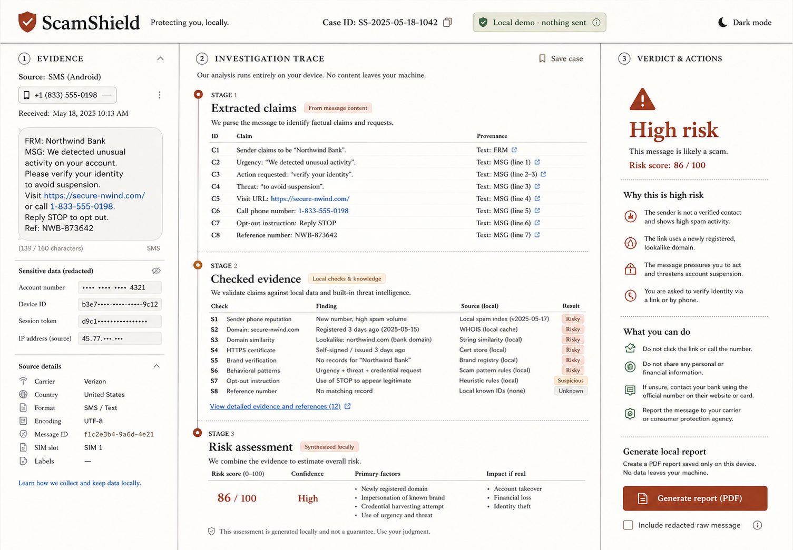

# ScamShield

ScamShield is an evidence-first agent for checking suspicious messages without opening their links, contacting their senders or transmitting their contents. It separates observed claims, deterministic offline checks and risk inference, then offers safer next steps in plain language.

Built for the **Good Neighbor Agents** track of the Agents for Humans hackathon using the [Strands Agents SDK](https://strandsagents.com/).



## The idea

Scam messages exploit speed and confusion. ScamShield creates a deliberate pause: it redacts sensitive fields, shows exactly what the message claims, exposes every local check behind the result and avoids pretending that a probabilistic assessment is certainty.

The demo contains only fictional evidence and runs without an AWS account by default.

## What works

- Three deterministic demo outcomes: high risk, needs context and low risk.
- Phone, email and account identifiers are redacted before persistent storage or agent reasoning.
- Suspicious URLs are parsed as text and never opened.
- Claims retain visible provenance instead of being presented as verified facts.
- Local evidence checks expose their finding, source and result.
- The risk assessment keeps confidence and uncertainty visible.
- A report is generated only after the exact `generate-local-report` approval.
- Rejection creates no report.
- Fixture mode provides a complete, zero-model-cost demo.
- Optional Amazon Bedrock reasoning uses a real Strands `Agent`, typed structured output and read-only tools.

## Architecture

```text
React investigation workspace
          |
          v
FastAPI case API
          |
          +--> in-memory redaction boundary
          |        +--> redacted Strands input
          |        +--> redacted SQLite case
          |
          +--> deterministic offline checks
          |        +--> domain text parsing (no requests)
          |        +--> pressure and credential rules
          |        +--> local sender fixture
          |
          +--> three-state risk assessment
          |
          +--> exact report approval gate --> one local Markdown report
```

The agent is not allowed to browse suspicious links, contact anyone or create a report. Strands contributes a constrained explanation and check ordering. Deterministic code owns redaction, evidence checks, scoring and the mutation boundary.

## Run locally

Prerequisites: Python 3.11+, [uv](https://docs.astral.sh/uv/) and Node.js 20+.

```bash
git clone <your-public-repository-url>
cd scamshield

cd backend
uv sync --dev
uv run uvicorn app.main:app --reload --host 127.0.0.1 --port 8000
```

In a second terminal:

```bash
cd frontend
npm ci
npm run dev -- --host 127.0.0.1 --port 5173
```

Open `http://127.0.0.1:5173`, choose a fictional message and run the analysis. The default fixture mode makes no external requests.

## Optional Bedrock-backed advice

Copy `.env.example` to `.env` and configure a model your AWS account can access:

```dotenv
SCAMSHIELD_FIXTURE_MODE=false
SCAMSHIELD_AWS_REGION=us-east-1
BEDROCK_MODEL_ID=your-model-id
AWS_PROFILE=your-profile
```

AWS usage may incur charges. Fixture mode is the recommended development and judging path. This repository does not claim an Amazon Bedrock AgentCore deployment; it integrates the open-source Strands Agents SDK with an optional Bedrock model provider.

## Verification

```bash
cd backend
uv run pytest -q
uv run ruff check .

cd ../frontend
npm test -- --run
npm run build
```

Current automated coverage: 11 backend tests and 3 frontend interaction tests. The tests cover redaction regressions, all three risk outcomes, provenance, rejection, exact approval and the zero-before/one-after report invariant.

The live responsive review covered 375, 768 and 1280 pixel widths, keyboard approval, light and dark themes and browser runtime errors. See [docs/VERIFICATION.md](docs/VERIFICATION.md) for the checked record.

## Repository map

```text
backend/app/agent/       Strands agent and approval-aware orchestration
backend/app/tools/       redaction, claim extraction and offline evidence checks
backend/app/assessment.py deterministic three-state risk assessment
backend/app/storage/     redacted case and report persistence
frontend/src/features/  evidence, investigation and verdict surfaces
docs/design/             original interface concept
```

## Safety boundaries

- Demo evidence is fictional.
- Raw message content is used only for deterministic in-memory checks.
- Only redacted content reaches Strands or SQLite case storage.
- URL handling uses `urllib.parse`; no message URL is requested.
- Risk output is guidance, not a guarantee.
- The app does not send reports, messages or notifications.
- Environment files, databases and build artifacts are excluded from Git.

## Built with Codex

This solo project was designed, implemented and tested with Codex as a development collaborator. Codex helped define the safety boundary, build the deterministic fixtures, connect Strands, create the responsive interface and verify submission claims against the code.

## License

Apache-2.0. See `LICENSE`.
